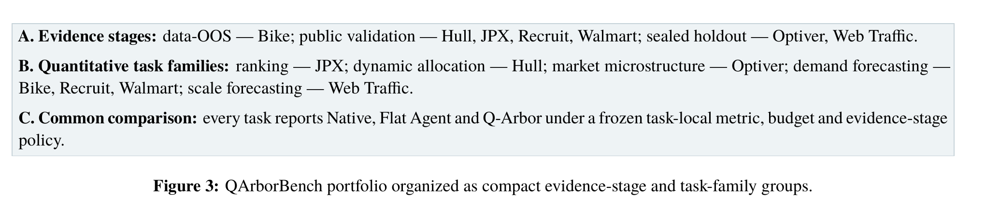
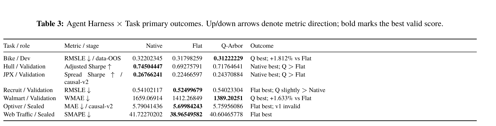

# QArborBench

QArborBench is a protocolized multi-task benchmark for comparing quantitative research harnesses. It standardizes task contracts, comparison arms, budgets, evaluation stages, result identity and evidence admissibility while keeping task semantics outside the harness core.

We propose QArborBench as a harness and evidence-governance benchmark. It does not claim complete coverage of quantitative finance or newly invented underlying datasets.

  
  
  
  

## Original task sources

QArborBench packages adapters, comparison protocol and accepted evidence around the following independently published tasks. Use the original pages for task definitions, data access, licenses and platform terms.

| QArborBench task | Original task page |
|---|---|
| Bike | [Bike Sharing Demand — Kaggle](https://www.kaggle.com/competitions/bike-sharing-demand) |
| Hull | [Hull Tactical - Market Prediction — Kaggle](https://www.kaggle.com/competitions/hull-tactical-market-prediction) |
| JPX | [JPX Tokyo Stock Exchange Prediction — Kaggle](https://www.kaggle.com/competitions/jpx-tokyo-stock-exchange-prediction) |
| Recruit | [Recruit Restaurant Visitor Forecasting — Kaggle](https://www.kaggle.com/competitions/recruit-restaurant-visitor-forecasting) |
| Walmart | [Walmart Recruiting - Store Sales Forecasting — Kaggle](https://www.kaggle.com/competitions/walmart-recruiting-store-sales-forecasting) |
| Optiver | [Optiver - Trading at the Close — Kaggle](https://www.kaggle.com/competitions/optiver-trading-at-the-close) |
| Web Traffic | [Web Traffic Time Series Forecasting — Kaggle](https://www.kaggle.com/competitions/web-traffic-time-series-forecasting) |

## v0.1 at a glance

- 7 executed, replaceable task contracts with complete Native, Flat Agent and Q-Arbor results.
- 5 representative task families.
- 3 primary evidence regimes.
- Native baseline, Flat Agent and Q-Arbor comparison arms.
- Frozen task-local metrics; heterogeneous raw metrics are never averaged.

  

## Results at a glance

  

## Agent Harness × Task

Arrows indicate metric direction. Results are accepted primary evidence after invalidation and causal-boundary reconciliation.

| Task / evidence | Metric | Native | Flat Agent | Q-Arbor | Outcome |
|---|---|---:|---:|---:|---|
| Bike / data-OOS | RMSLE ↓ | 0.32202345 | 0.31798259 | **0.31222229** | Q best |
| Hull / public validation | Adjusted Sharpe ↑ | **0.74504447** | 0.69275791 | 0.71764641 | Native best; Q > Flat |
| JPX / public validation causal-v2 | Spread Sharpe ↑ | **0.26766241** | 0.22466597 | 0.24370884 | Native best; Q > Flat |
| Recruit / public validation | RMSLE ↓ | 0.54102117 | **0.52499679** | 0.54023304 | Flat best |
| Walmart / public validation | WMAE ↓ | 1659.06914 | 1412.26849 | **1389.20251** | Q best |
| Optiver / sealed causal-v2 | MAE ↓ | 5.79041436 | **5.69984243** | 5.75956086 | Flat best; v1 excluded |
| Web Traffic / sealed | SMAPE ↓ | 41.72270202 | **38.96549582** | 40.60465778 | Flat best |

Primary directional summary:

- Flat Agent vs Native: 5 wins, 2 losses.
- Q-Arbor vs Native: 5 wins, 2 losses.
- Q-Arbor vs Flat Agent: 4 wins, 3 losses.
- Public validation, Q-Arbor vs Flat Agent: 3 wins in 4 cells.

## Repository map

- [`benchmark/registry.json`](benchmark/registry.json): sanitized 7-cell registry and frozen source identities.
- [`protocol/protocol.json`](protocol/protocol.json): comparison, budget, stage and admissibility rules.
- [`schemas/task-contract.schema.json`](schemas/task-contract.schema.json): public adapter contract schema.
- [`results/summary.json`](results/summary.json): machine-readable accepted results.
- [`tasks/`](tasks/): one public card per benchmark cell.
- [`docs/ADAPTERS.md`](docs/ADAPTERS.md): contribution and integration rules.
- [`docs/EVIDENCE_POLICY.md`](docs/EVIDENCE_POLICY.md): leakage, completeness and held-out evidence rules.

## Use with Q-Arbor

QArborBench tasks are replaceable experiment adapters. [Q-Arbor](https://github.com/hu-jy23/Q-Arbor) consumes task-local adapter, runner, stage-policy, result-envelope and provenance identities through its open control surface. Competition and platform names never enter the shared core semantics.

## Reproduction boundary

This repository publishes benchmark specifications, public task cards and accepted aggregate evidence. It does not redistribute raw or derived row-level data, hidden labels, unopened time tails, protected evaluator/selector implementations, credentials, internal Agent sessions, attempts, ledgers or smoke outputs.

Each primary arm has one formal run. Results do not establish statistical score stability, universal superiority, trading profitability or exact provider cost.

## License

Benchmark code and documentation are licensed under Apache-2.0. Underlying datasets remain governed by their original licenses and platform terms.
